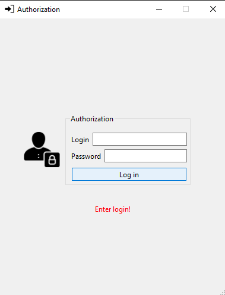
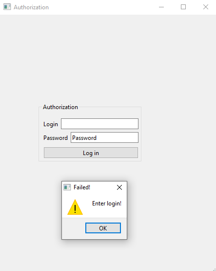
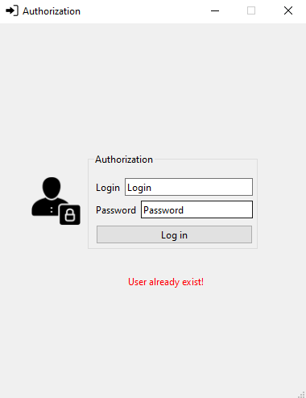
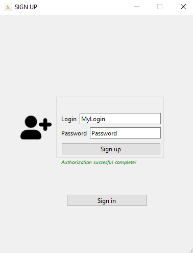
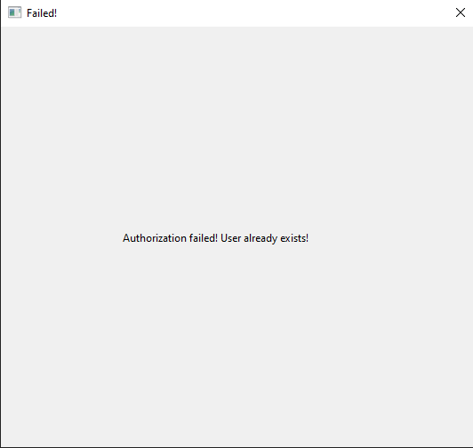

# User authorization 
 A project on user authorization developed on Qt, which is linked to a database (the database itself is not present as it is not source code files). The user enters a login and password and if it is in the database then a message that he is already authorized otherwise, if it is not, it is entered into the database and a message about successful authorization pops up!
 
 
 
 
 