# User authorization 

## 🚀 Features

This is a Qt project for authorizing a client or logging into their account. 
If you have an account, you click Sign In and log in, and if you don't, you enter your login and password and register. 
After that your login and password are added to the database.

## 📦 Installation

```bash
git clone https://github.com/1123581321345589144233377610/User-Authorization.git
cd User-Authorization
```
## 📷 Screenshots

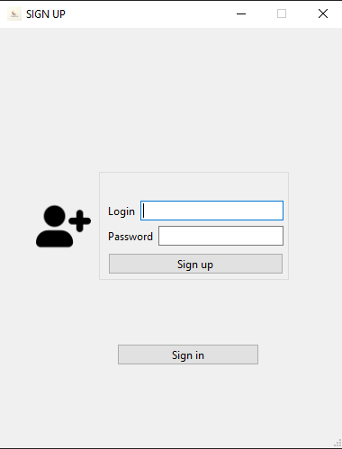

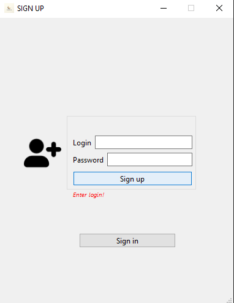

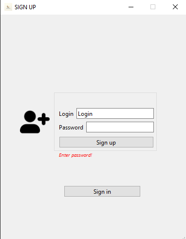

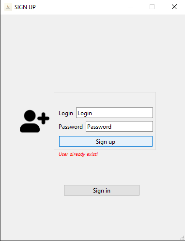

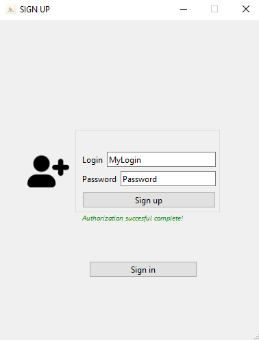

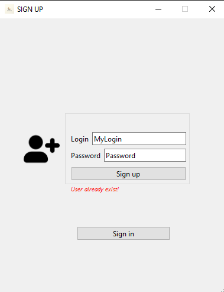

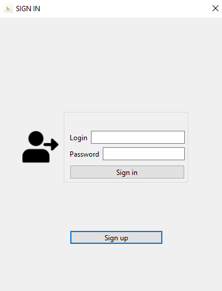

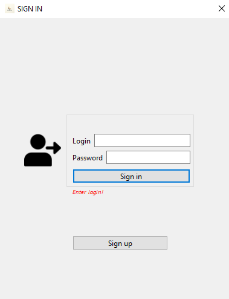

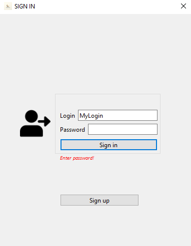

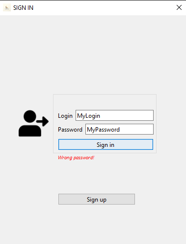


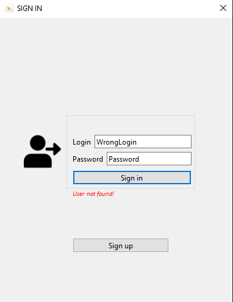

## 👤 Author

**Dima M. Shirokov**
- [GitHub](https://github.com/1123581321345589144233377610)